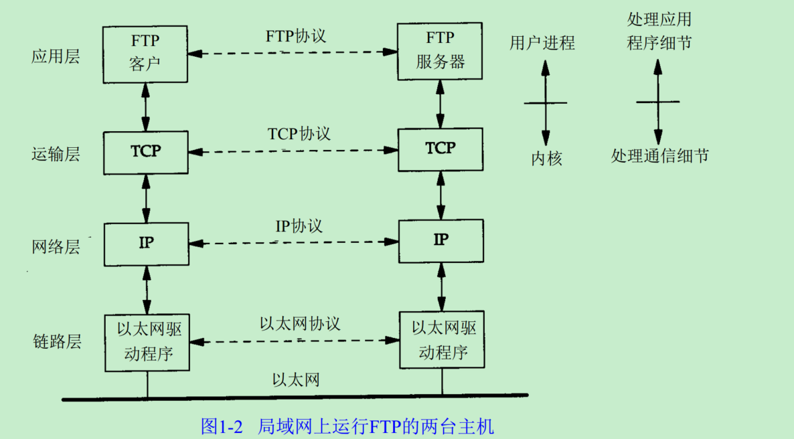
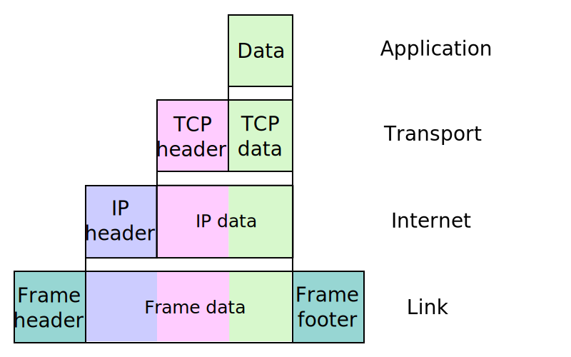
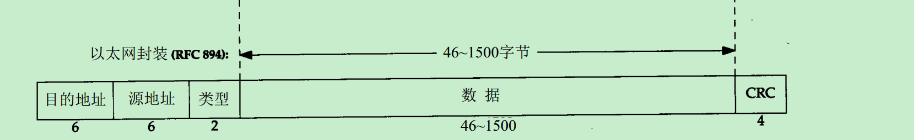
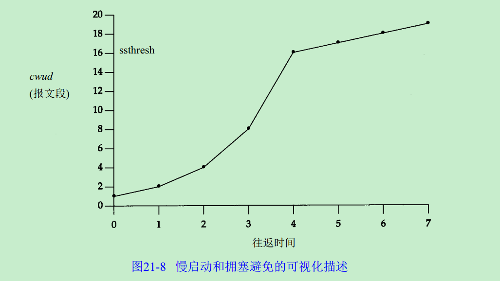

[TOC]

### TCP/IP协议族
网络协议一般会分为若干层，每层负责不同的功能。一个协议族是指不同层次的多个协议的一个组合。
tcp/ip就是一个四层的协议族，由上至下:
    1. 应用层  HTTP等
    2. 传输层  TCP, UDP
    3. 网络层  IP, ICMP, IGMP
    4. 数据链路层  设备驱动，网络接口卡

1. 同一层使用相同的协议进行通信。
2. 应用层的功能是在用户空间中运行，关注的是应用功能的细节。不关心数据包是如何传输的。
3. 传输层以下，都是运行在内核空间中的。关注的是数据包的传输细节。不关心业务数据如何处理。
4. 通过分层的设计，保证了各个功能模块高内聚，低耦合。如果某个层的功能需要修改，不会影响到其他层的功能。

<!-- #### tcp和ip为什么要分为两层？
1. 多个主机组成局域网
2. 多个局域网组成互联网
3. 局域网之间，通过路由器相连接。路由器的好处是，可以将不同类型的物理网络连接起来。(比如连接以太网和令牌环网) -->
#### 封装
当应用使用tcp传递数据时，数据被传入协议栈，逐个通过每一层，最后被转换为比特流送入网络。
1. TCP层封装的数据称为TCP段(TCP Segment)
2. IP层封装的数据称为IP数据报(IP Datagram)
3. 通过以太网传输的比特流称为帧(Fragment)
    帧的长度必须为46~1500byte之间

<!-- #### 通用端口号
可以在linux的/etc/services文件中看到

### 以太网分析
路径MTU  两台通信主机路径中最小的MTU

#### 环回接口
A类网络号127就是为环回接口预留的。一般地址为127.0.0.1
允许同一台主机上的客户程序和服务器程序通过tcp/ip通信。一个传给环回 -->

<!-- ### 为什么会有MTU？ -->

### 链路层（以太网）
数据最终是要转化为电信号，通过网线进行传输的。现在最常用的局域网结构就是以太网了。
* 以太网使用带冲突检测的载波侦听多路访问（CSMA/CD）。这项技术规定了多台计算机共享一个通道的方法。
* 载波侦听（英语：Carrier Sense）指任何连接到介质的设备在欲发送帧前，必须对介质进行侦听，当确认其空闲时，才可以发送
* 多路访问（英语：Multiple Access）指多个设备可以同时访问介质，一个设备发送的帧也可以被多个设备接收。

#### 以太网帧数据结构

目标地址和源地址就是网卡的mac地址。
* 以太网帧为什么有最大长度和最小长度的限制？
1. 最小长度是为了使以太网中两台距离最远的主机，在发送数据时，如果发生冲突可以被监听到。
   
2. 最大长度是为了单一主机占用信道时间过长。

### IP协议

#### 不可靠
    不可靠是指ip数据报不一定能到达目的地。
    例如某个路由器暂时用完了缓冲区，则会丢弃数据报，发送ICMP给信息源

#### 无连接
    不维护任何关于后续数据报的状态信息。每个数据报的处理都是独立的。
    比如IP数据报可以不按发送顺序接收。按顺序发送数据报A，B，可能因为选择了不同的路线，数据报B可以先到达

#### ip头部

<table class="wikitable" style="margin: 0 auto; text-align: center;">
<caption>IPv4 Header Format
</caption>
<tbody><tr>
<th><i>Offsets</i>
</th>
<th><a href="/wiki/Octet_(computing)" title="Octet (computing)">Octet</a>
</th>
<th colspan="8">0
</th>
<th colspan="8">1
</th>
<th colspan="8">2
</th>
<th colspan="8">3
</th></tr>
<tr>
<th><a href="/wiki/Octet_(computing)" title="Octet (computing)">Octet</a>
</th>
<th><a href="/wiki/Bit" title="Bit">Bit</a>
</th>
<th style="width:2.6%;">0
</th>
<th style="width:2.6%;">1
</th>
<th style="width:2.6%;">2
</th>
<th style="width:2.6%;">3
</th>
<th style="width:2.6%;">4
</th>
<th style="width:2.6%;">5
</th>
<th style="width:2.6%;">6
</th>
<th style="width:2.6%;">7
</th>
<th style="width:2.6%;">8
</th>
<th style="width:2.6%;">9
</th>
<th style="width:2.6%;">10
</th>
<th style="width:2.6%;">11
</th>
<th style="width:2.6%;">12
</th>
<th style="width:2.6%;">13
</th>
<th style="width:2.6%;">14
</th>
<th style="width:2.6%;">15
</th>
<th style="width:2.6%;">16
</th>
<th style="width:2.6%;">17
</th>
<th style="width:2.6%;">18
</th>
<th style="width:2.6%;">19
</th>
<th style="width:2.6%;">20
</th>
<th style="width:2.6%;">21
</th>
<th style="width:2.6%;">22
</th>
<th style="width:2.6%;">23
</th>
<th style="width:2.6%;">24
</th>
<th style="width:2.6%;">25
</th>
<th style="width:2.6%;">26
</th>
<th style="width:2.6%;">27
</th>
<th style="width:2.6%;">28
</th>
<th style="width:2.6%;">29
</th>
<th style="width:2.6%;">30
</th>
<th style="width:2.6%;">31
</th></tr>
<tr>
<th>0
</th>
<th>0
</th>
<td colspan="4"><a href="#Version">Version</a>
</td>
<td colspan="4"><a href="#IHL">IHL</a>
</td>
<td colspan="6"><a href="#DSCP">DSCP</a>
</td>
<td colspan="2"><a href="#ECN">ECN</a>
</td>
<td colspan="16"><a href="#Total_Length">Total Length</a>
</td></tr>
<tr>
<th>4
</th>
<th>32
</th>
<td colspan="16"><a href="#Identification">Identification</a>
</td>
<td colspan="3"><a href="#Flags">Flags</a>
</td>
<td colspan="13"><a href="#Fragment_Offset">Fragment Offset</a>
</td></tr>
<tr>
<th>8
</th>
<th>64
</th>
<td colspan="8"><a href="#TTL">Time To Live</a>
</td>
<td colspan="8"><a href="/wiki/List_of_IP_protocol_numbers" title="List of IP protocol numbers">Protocol</a>
</td>
<td colspan="16"><a href="#Header_Checksum">Header Checksum</a>
</td></tr>
<tr>
<th>12
</th>
<th>96
</th>
<td colspan="32"><a href="#Source_address">Source IP Address</a>
</td></tr>
<tr>
<th>16
</th>
<th>128
</th>
<td colspan="32"><a href="#Destination_address">Destination IP Address</a>
</td></tr>
<tr>
<th>20
</th>
<th>160
</th>
<td colspan="32" rowspan="4"><a href="#Options">Options</a> (if IHL &gt; 5)
</td></tr>
<tr>
<th>24
</th>
<th>192
</th></tr>
<tr>
<th>28
</th>
<th>224
</th></tr>
<tr>
<th>32
</th>
<th>256
</th></tr></tbody></table>

1. Version 
   长度: 4bit  
   含义: 版本号。ipv4对应值是4
2. IHL(Internet Header Length) 
   长度: 4bit
   含义: ip数据报头部长度。以4字节为单位。所以最大长度为60(15*4)。在一般情况下为5.表示ip数据报头部长度为20byte。如果携带了options，会大于5
3. Total Length
   长度: 16bit
   含义: 整个ip数据报的长度。以字节为单位。所以一个ip数据报的最大长度为65535字节。
   1. 主机要求不能接收超过576字节的数据报。UDP等协议限制用户的数据报长度为512字节。但是目前大多数实现(NFS)允许超过8192字节的ip数据报。
   2. 以太网帧的最小长度为46字节。如果ip数据报长度不够，会填充一些数据达到最小长度。如果没有总长度，则无法区分出那些是填充内容，哪些是数据报内容
4. Identification
   长度: 16bit
   含义: 唯一的标识主机发送的数据报。每发送一个数据报，该值就会加一
5. Flags
   长度: 3bit
   含义: 标识字段
6. Fragment Offset
   长度: 13bit
   含义: 片偏移字段
7. Time To Live(TTL)
    长度: 8bit
    含义: 数据报可以经过的最多路由器数。一般为32或64。
    1. 每经过一个路由器，值就会减一。当变为0时，会发送ICMP通知源主机。
    2. 有了TTL字段，就可以保证一个无效的数据报不会一直在网络中被转发。
8. Protocol
    长度: 8bit
    含义: ip数据报中的数据部分使用的协议。
    协议表 https://en.wikipedia.org/wiki/List_of_IP_protocol_numbers
9. Header Checksum
    长度: 16bit
    含义: 首部校验和。只对ip首部进行检验，不包含后面的数据部分。
10. Source IP Address 32bit的源ip地址
11. Destination IP Address 32bit的目标IP地址
12. Options  选项字段。根据需要添加。不是所有的ip数据报都有

#### ip路由选择
1. 简单描述:
    1. 两台机器在同一个局域网(以太网)内，则直接将数据报发送给目标主机
    2. 两台主机不在统一局域网内，则源主机将ip数据报发给默认路由器，由路由器来转发该数据报。
2. ip发送数据的步骤
    1. ip层模块，在内存中有个路由表。当接收到数据并发送时，会对路由表进行一次搜索。
       1. 当数据报来自某个网络接口时，查看目的地址是否为本机的ip地址，或ip广播地址。如果是，则将数据部分交由ip头指定的协议模块进行处理。
       2. 如果目的地址是上面说的那些，如果主机配置为路由器，则将数据报转发。否则数据报被丢弃

    2. 搜索路由表的顺序
       1. 查找完全匹配网络号和主机号的表项。
       2. 查找匹配网络号的表项。
       3. 查找目标名为default的表项。
    如果找到了对应的表项，则把数据包发送给下一站路由器。
    如果没找到对应的表项，则会向生成数据的应用程序返回一个“主机不可达”，或"网络不可达"的错误

<!-- 3. 子网划分
    将ip中的主机号，划分为子网号和主机号。
    子网掩码。用来区分主机号和网络号+子网号。
    知道本机的ip地址后，就能知道它是A类，B类还是C类地址。这样就能知道网络号和子网号的分界线。
    有了ip地址和子网掩码，拿到目标ip就能知道:
        1. 同一个子网中的主机
        2. 本网络中其他子网中的主机
        3. 其他网络上的主机  -->

### ARP协议
以太网规定，在同一个局域网中的一台主机要和另一台主机通信，必须要知道目标主机的mac地址。而在tcp/ip协议中，传输层和网络层只关心目标主机的ip地址。
以太网协议模块接收到的ip数据中，只包含目标主机的ip地址。需要一种方法，根据目标主机的ip地址获取其mac地址。
这就是ARP(address resolution protocol)地址解析协议要做的事。在主机发送帧前将目标ip地址转换为mac地址。

一台主机将以太网帧发送到同一个网络的另一台主机上时，使用的是以太网的MAC地址(48bit)来确定目的地。驱动程序不会查看ip数据报中的ip地址。
ARP(地址解析协议)提供ip地址到硬件地址的动态映射。

#### 报文格式
<table class="wikitable" style="text-align:center;">
<tbody><tr>
<th>长度(位)</th>
<th>48</th>
<th>48</th>
<th>16</th>
<th>16</th>
<th>16</th>
<th>8</th>
<th>8</th>
<th>16</th>
<th>48</th>
<th>32</th>
<th>48</th>
<th>32
</th></tr>
<tr>
<td style="min-height:60px;"><b>数据类型</b></td>
<td style="width:96px;">目标以太网地址</td>
<td style="width:96px;">源以太网地址</td>
<td style="width:32px;">帧类型</td>
<td style="width:32px;">硬件类型</td>
<td style="width:32px;">协议类型</td>
<td style="width:16px;">硬件地址长度</td>
<td style="width:16px;">协议地址长度</td>
<td style="width:32px;">操作码</td>
<td style="width:96px;">源硬件地址</td>
<td style="width:64px;">源协议地址</td>
<td style="width:96px;">目标硬件地址</td>
<td style="width:64px;">目标协议地址
</td></tr>
<tr>
<td><b>组成</b></td>
<td colspan="3">14字节 以太网首部</td>
<td colspan="9">28字节 ARP请求/应答
</td></tr></tbody></table>

* 以太网帧头部
    1. 目标以太网地址 ff:ff:ff:ff:ff:ff。全为1，是广播地址。局域网中的所有网络接口都会接收此数据帧。
    2. 帧类型是0x0806，代表arp请求/应答

* arp相关数据:
  1. 硬件类型: 以太网 0x0001
  2. 协议类型: ipv4  0x0800
  3. 硬件地址长度，以字节为单位。表示的是mac地址长度，所以值为0x06.
  4. 协议地址长度，以字节为单位。表示的是ip地址长度，值为0x04.
  5. 操作码: 1arp请求，2arp应答

* 因为arp请求/应答长度为28字节，加载以太网帧头16字节，不满足以太网帧的最小长度60字节，在尾部会添加填充字节。

#### 存在的问题
ARP欺骗。arp是采用广播的方式询问目标主机的mac地址，会使用第一个应答的数据，不理会后面到达的数据。没有任何的验证机制，所以收到的arp应答信息可能是假的。

### ICMP 
internet控制报文协议。icmp报文包含在ip数据报中。

* 报文格式
<table class="wikitable">
<caption>ICMP Header Format
</caption>
<tbody><tr>
<th><i>Offsets</i>
</th>
<th><a href="/wiki/Octet_(computing)" title="Octet (computing)">Octet</a>
</th>
<th colspan="8">0
</th>
<th colspan="8">1
</th>
<th colspan="8">2
</th>
<th colspan="8">3
</th></tr>
<tr>
<th style="border-top: none"><a href="/wiki/Octet_(computing)" title="Octet (computing)">Octet</a>
</th>
<th><a href="/wiki/Bit" title="Bit">Bit</a>
</th>
<th style="width:2.6%;">0
</th>
<th style="width:2.6%;">1
</th>
<th style="width:2.6%;">2
</th>
<th style="width:2.6%;">3
</th>
<th style="width:2.6%;">4
</th>
<th style="width:2.6%;">5
</th>
<th style="width:2.6%;">6
</th>
<th style="width:2.6%;">7
</th>
<th style="width:2.6%;">8
</th>
<th style="width:2.6%;">9
</th>
<th style="width:2.6%;">10
</th>
<th style="width:2.6%;">11
</th>
<th style="width:2.6%;">12
</th>
<th style="width:2.6%;">13
</th>
<th style="width:2.6%;">14
</th>
<th style="width:2.6%;">15
</th>
<th style="width:2.6%;">16
</th>
<th style="width:2.6%;">17
</th>
<th style="width:2.6%;">18
</th>
<th style="width:2.6%;">19
</th>
<th style="width:2.6%;">20
</th>
<th style="width:2.6%;">21
</th>
<th style="width:2.6%;">22
</th>
<th style="width:2.6%;">23
</th>
<th style="width:2.6%;">24
</th>
<th style="width:2.6%;">25
</th>
<th style="width:2.6%;">26
</th>
<th style="width:2.6%;">27
</th>
<th style="width:2.6%;">28
</th>
<th style="width:2.6%;">29
</th>
<th style="width:2.6%;">30
</th>
<th style="width:2.6%;">31
</th></tr>
<tr>
<th>0
</th>
<th>0
</th>
<td colspan="8"><a href="#header_type">Type</a>
</td>
<td colspan="8"><a href="#header_code">Code</a>
</td>
<td colspan="16"><a href="#header_checksum">Checksum</a>
</td></tr>
<tr>
<th>4
</th>
<th>32
</th>
<td colspan="32"><a href="#header_rest">Rest of Header</a>
</td></tr>
</tbody></table>

* icmp类型。由类型字段和代码字段共同决定
* 差错报文会包含ip首部，和ip数据报中数据部分的前8个字节(tcp,udp的端口号)。这样就能找出ip层的上层协议(根据ip头中的协议字段)，和对应的进程(根据端口号)
* 详细解释  https://zh.wikipedia.org/wiki/%E4%BA%92%E8%81%94%E7%BD%91%E6%8E%A7%E5%88%B6%E6%B6%88%E6%81%AF%E5%8D%8F%E8%AE%AE

#### ping
发送icmp回显请求给目标主机

#### UDP
* udp首部
<table class="wikitable" style="margin: 0 auto; text-align: center;">
<caption>UDP报头
</caption>
<tbody><tr>
<th style="border-bottom:none; border-right:none;">偏移
</th>
<th style="border-left:none;"><a href="/wiki/%E5%85%AB%E4%BD%8D%E5%85%83%E7%B5%84" title="八字节">字节</a>
</th>
<th colspan="8">0
</th>
<th colspan="8">1
</th>
<th colspan="8">2
</th>
<th colspan="8">3
</th></tr>
<tr>
<th style="border-top: none">字节
</th>
<th><tt><a href="/wiki/%E4%BD%8D%E5%85%83" title="比特">位</a></tt></th>
<th><tt>&nbsp;0</tt></th>
<th><tt>&nbsp;1</tt></th>
<th><tt>&nbsp;2</tt></th>
<th><tt>&nbsp;3</tt></th>
<th><tt>&nbsp;4</tt></th>
<th><tt>&nbsp;5</tt></th>
<th><tt>&nbsp;6</tt></th>
<th><tt>&nbsp;7</tt></th>
<th><tt>&nbsp;8</tt></th>
<th><tt>&nbsp;9</tt></th>
<th><tt>10</tt></th>
<th><tt>11</tt></th>
<th><tt>12</tt></th>
<th><tt>13</tt></th>
<th><tt>14</tt></th>
<th><tt>15</tt></th>
<th><tt>16</tt></th>
<th><tt>17</tt></th>
<th><tt>18</tt></th>
<th><tt>19</tt></th>
<th><tt>20</tt></th>
<th><tt>21</tt></th>
<th><tt>22</tt></th>
<th><tt>23</tt></th>
<th><tt>24</tt></th>
<th><tt>25</tt></th>
<th><tt>26</tt></th>
<th><tt>27</tt></th>
<th><tt>28</tt></th>
<th><tt>29</tt></th>
<th><tt>30</tt></th>
<th><tt>31</tt>
</th></tr>
<tr>
<th>0
</th>
<th><tt> 0</tt>
</th>
<td colspan="16" style="background:#fdd;">来源连接端口</td>
<td colspan="16">目的连接端口
</td></tr>
<tr>
<th>4
</th>
<th><tt>32</tt>
</th>
<td colspan="16">报文长度</td>
<td colspan="16" style="background:#fdd;">校验和
</td></tr></tbody></table>

### TCP
* tcp(Transaction control protocol) 是一种面向连接的，可靠的字节流服务。
* 关键字： 面向连接，可靠，字节流
* 建立连接的过程就像打电话一样，拨号之后，需要等对方接通之后，才能开始通话(传输数据)

#### 报文格式
<table class="wikitable" style="margin: 0 auto; text-align:center">
<caption>TCP Header
</caption>
<tbody><tr>
<th style="border-bottom:none; border-right:none;"><i>Offsets</i>
</th>
<th style="border-left:none;"><a href="/wiki/Octet_(computing)" title="Octet (computing)">Octet</a>
</th>
<th colspan="8">0
</th>
<th colspan="8">1
</th>
<th colspan="8">2
</th>
<th colspan="8">3
</th></tr>
<tr>
<th style="border-top: none">Octet
</th>
<th><a href="/wiki/Bit" title="Bit">Bit</a></th>
<th>&nbsp;7</th>
<th>&nbsp;6</th>
<th>&nbsp;5</th>
<th>&nbsp;4</th>
<th>&nbsp;3</th>
<th>&nbsp;2</th>
<th>&nbsp;1</th>
<th>&nbsp;0</th>
<th>&nbsp;7</th>
<th>&nbsp;6</th>
<th>5</th>
<th>4</th>
<th>3</th>
<th>2</th>
<th>1</th>
<th>0</th>
<th>7</th>
<th>6</th>
<th>5</th>
<th>4</th>
<th>3</th>
<th>2</th>
<th>1</th>
<th>0</th>
<th>7</th>
<th>6</th>
<th>5</th>
<th>4</th>
<th>3</th>
<th>2</th>
<th>1</th>
<th>0
</th></tr>
<tr>
<th>0
</th>
<th>0
</th>
<td colspan="16">Source port</td>
<td colspan="16">Destination port
</td></tr>
<tr>
<th>4
</th>
<th>32
</th>
<td colspan="32">Sequence number
</td></tr>
<tr>
<th>8
</th>
<th>64
</th>
<td colspan="32">Acknowledgment number (if ACK set)
</td></tr>
<tr>
<th>12
</th>
<th>96
</th>
<td colspan="4">Data offset</td>
<td colspan="3">Reserved <b>0 0 0</b></td>
<td>
NS
</td>
<td>
CWR
</td>
<td>
ECE
</td>
<td>
URG
</td>
<td>
ACK
</td>
<td>
PSH
</td>
<td>
RST
</td>
<td>
SYN
</td>
<td>
FIN
</td>
<td colspan="16">Window Size
</td></tr>
<tr>
<th>16
</th>
<th>128
</th>
<td colspan="16">Checksum</td>
<td colspan="16">Urgent pointer (if URG set)
</td></tr>
<tr>
<th>20 ...
</th>
<th>160 ...
</th>
<td colspan="32" style="background:#ffd0d0;">Options (if <i>data offset</i> &gt; 5. Padded at the end with "0" bytes if necessary.) ...
</td></tr></tbody></table>

* 关键字段
1. 16位的目标端口和源端口。标识两台主机上进行通信的两个进程。ip地址+端口号能唯一的标识出一个tcp连接。
2. 32位的序号。表示报文段中第一个字节的序号。第一个序号是ISN(初始序号) + 1.
3. 32位的确认序号。表示接收端下次想接收的下一个序号。是成功接收的字节序号 + 1。接收到了10字节，则确认序号是11.
4. 4位的首部长度(数据偏移)。以4字节为单位的首部长度。如果不带选项部分，一般是20字节。首部长度只有四位表示，所以最大长度为60字节(4 * 15).
5. 标志位。
6. 16位的窗口大小。以字节位单位，最大值65535。
7. 16位的校验和。包含tcp头部，tcp数据。
8. 常用的可选字段是最长报文大小(MSS).通信双方会在建立连接的第一个报文段(SYN=1)中指明。

* flag中的标记
1. SYN  建立连接时，请求同步
2. FIN 发送放数据发送完成
3. ACK 确认接收到数据
4. RST 重置连接
5. PSH 接收方尽快将接收到的数据全部提交给接收进程

#### 建立连接的3次握手

1. 客户端发送一个SYN=1的数据段，这个数据段的序列号字段为客户端的初始序列号。
2. 服务器端返回一个SYN=1，ACK=1的数据段作为应答。这个数据段中的序列号字段为服务端的初始序列号，应答序列号字段的值为客户端的ISN+1
3. 客户端返回一个ACK=1的数据段，对服务器的SYN报文进行应答。应答序列号为服务端的ISN+1.

#### 断开连接的4次握手

* 断开连接需要4次握手，是因为TCP是双向的连接(两端能同时发送消息)，所以每个方向上都需要单独关闭

#### 2MSL的等待
在客户端发送了ACK数据段之后，不会立刻关闭socket，还会等待2MSL(2倍的报文最大生存时间)。这样是为了防止ACK报文丢失，需要再次发送ACK数据段

#### 最大报文长度
* 最大可以为1460. 以太网帧的最大长度1500 - ip首部20字节 - tcp首部20字节。
* 建立连接时，双方会在syn报文的选项中，携带MSS。会取两端中最小的MSS。(路径中MSS，使用MSS发现机制)如果一方不接收来自另一方的MSS，则MSS的默认值为536。

#### RTS标志
当一些意外的数据包到达主机时，主机会在此线路上返回一个RST数据包。意外情况有:
1. 到不存在的端口的连接请求。
2. 异常中止一个连接

#### 延时确认 需要重新读一遍
接收到数据之后，不是立即发送ACK。等待有数据发送到另一端时，带上ACK相关信息。一般最大的时延为200ms。

#### Nagle算法
* 如果大量的数据包中，每个数据包都只有少量的数据需要发送(比如只有10个字节，比数据包的头部ip首部+tcp首部 40字节还短)，会浪费带宽导，致网络拥塞。为了解决这个问题
提出了Nagle算法。
* 在一个tcp连接上，只能有一个未确认的数据包。在这个数据包确认之前，停止发送数据。此时会将少量数据的数据包组合成一个大的数据包，获得发送机会再发送。这样就能减少数据包的发送了。
* 有如下情况则立即发送
1. 包长度到达MSS
2. 该包含有FIN
3. 发生了超时200ms。

延时确认和Nagle算法都能减少网络流量，但增加了网络通信延时。单独使用可能问题不大，但如果两个方法都启用了，会出现如下情况
1. 服务端使用延时确认，收到数据之后不立即返回ACK
2. 客户端使用Nagle算法，未收到ACK，不继续发送数据包。
这样就导致双方都在等待，极大的降低了效率。

#### tcp的超时与重传
基本原理就是为每个数据段启动一个计时器（计时器会因为各种原因变化）。当计时器溢出，而还未收到ACK，就认为数据段丢失，重新发送数据段。
如果发送数据包1，2，3，4，接收端收到了1，2，4，数据包3丢失了。此时ACK的确认序号是3，需要用户重传3号数据包。不会发送ACK=4的包。

<!-- 每个连接，tcp管理四个不同的定时器
1. 重传定时器。用来倒计时收到另一端的确认。
2. persist定时器。
3. 保活定时器
4. 2MSL定时器。time_wait状态的连接需要等待的时间。 -->

<!-- * 关键点之一就是对一个给定连接的往返时间(RTT)的测量
重传时间间隔是以2的指数级进行递增的。 -->

### 滑动窗口
* 在tcp首部中，有一个窗口大小的字段。窗口大小需要和确认序号配合使用，指定能发送的数据范围。范围是[确认序号, 确认序号+窗口大小)
* 如果窗口的左边沿和右边沿相等，则称为零窗口。此时发送方不能发送任何数据。
* 窗口大小由接收方的进程控制。可能会影响tcp的性能。
* 表示窗口大小的字段只有16位，所以窗口的最大值为64k。当窗口大于64k时，需要一个使用一个tcp选项window scale option来指定窗口扩大的倍数。

### 慢启动和拥塞避免
最初的TCP在连接建立成功后会向网络中发送大量的数据包，这样很容易导致网络中路由器缓存空间耗尽，从而发生拥塞。因此新建立的连接不能够一开始就大量发送数据包，而只能根据网络情况逐步增加每次发送的数据量，以避免上述现象的发生。

* 发送方有一个窗口，称为拥塞窗口(cwnd)。这个窗口的大小代表是发送出去还没有接收到ACK的数据包的书俩个。当与另一台主机建立tcp连接时，拥塞窗口被初始化为1个报文段大小。收到一个ACK报文段后，拥塞窗口就加一。
  1 -> 2 -> 3，4 -> 5,6,7,8...，这样就实现了指数级的增长。

* 发送报文时，以拥塞窗口和通告窗口中最小的值为上限。拥塞窗口是发送方的流量控制，通告窗口是接收方的流量控制。

* 如果按照慢启动的指数级方式一直增加，则带宽会很快被耗尽。慢启动的增速一点也不慢，只是起点低而已。所以慢启动超过一个阈值(ssthresh)之后，就进入拥塞避免阶段，进行线性增长。发了cwnd个数据段后，接收到了cwnd个确认数据段，cwnd才增加1。

* cwnd的大小以字节为单位。一个报文段的大小可以当作是一个MSS(最大报文大小)的大小。

* 上面说的流程是在没有发生拥塞的情况下执行的。如果发生拥塞，则需要根据触发拥塞的情况进行分类。
    1. 发送的数据包超时。
    2. 收到3个相同的ACK
   
##### 数据包超时
1. tcp对每一个报文都有一个重传定时器(RTO),RTO超时，就会重新发送此数据包。这种情况下TCP的反应比较强烈，执行如下操作：
    1. 把ssthresh变为cwnd的一半
    2. 把cwnd设置为1
    3. 重新进入慢启动过程。

##### 收到3个相同的ACK
1. tcp收到乱序到达的包时，会立即发送ACK。收到3个ACK表示有数据包丢失了。此时执行快速重传。
    1. 把ssthresh设置为cwnd的一半
    2. 把cwnd设置为ssthresh的值
    3. 重新进入拥塞避免阶段。

##### 快速恢复算法
1. 快速恢复算法是在快速重传算法后面添加的。一般和快速重传一起使用。主要思想是“数据包守恒”，即网络上的数据包总数不变。执行流程如下
    1. 把ssthresh设置为cwnd的一半，设置cwnd为ssthresh + 3。开始重传丢失的报文。+3是因为这3个数据包已经离开网络，被主机接收了。
    2. 再收到重复的ACK时，cwnd加一。
    3. 当收到新的ACK时，把cwnd设置为第一步设置的ssthresh的值。这是因为新的ACK确认了丢失的报文和此报文后续的数据。说明恢复过程已经结束，可以恢复之前的状态，即进入拥塞避免阶段。

<!-- 
### 拥塞避免
* 拥塞
发送的数据包过多时，转发数据包的路由器缓冲区满了，无法缓存数据包了，此时会丢弃后续的数据报。拥塞避免算法是一种处理丢失分组的方法。

* 拥塞避免算法
假设因为其他原因产生的丢包非常少(小于1%)，数据包丢失就意味着通信的两台主机之间的网络，在某一处发生了拥塞。

* 拥塞避免算法和慢启动算法经常一起实现。

* 执行如下步骤
    1. 对一个给定连接，初始化cwnd为1个报文， ssthresh为65535个字节
    2. 发送方的输出不能超过cwnd，和接收窗口rwnd的大小。cwnd是发送方的流量控制，接收窗口是接收方的流量控制。
    3. 当拥塞发生时(超时或收到重复的确认)，ssthresh被设置为当前窗口大小的一半(cwnd和rwnd中较小的值的一半)。如果是超时引起的拥塞，cwnd被设置为1个报文段。
    4. 当数据被对方确认后，就增加cwnd。
       1. 如果cwnd小于等于ssthresh，则是在执行慢启动。指数级增加。收到一个数据包，cwnd增加1。
       2. cwnd大于sstresh执行拥塞避免。线性增加。收到一个数据包，指增加1/cwnd(等价于收到cwnd个数据包才增加1)。
       3. 慢启动一直持续到cwnd增加到 拥塞发生时窗口大小的一半。

### 快速重传
* 当收到一个失序的报文段时，tcp应该立即产生一个ACK(一个重复的ACK)。这个重复的ACK不应该被延迟。这个ACK的目的是告诉发送方，自己收到了一个失序的报文段，并告诉发送方自己希望收到的序号。
* 单独一个重复的ack可能是
	1. 报文段的重新排序
	2. 报文段丢失
所以需要等待少量的重复ACK。

* 收到3个或3个以上的重复ACK，就非常可能是丢失了报文段。于是发送方重传丢失的数据报文，不必等待超时定时器的溢出。这就是快速重传算法。之后启动的是拥塞避免算法。这些操作就称为快速恢复算法。

* 执行如下操作
    1. 收到第三个重复ACK，将ssthresh设置为cwnd的一半。重传丢失的报文。cwnd设置为ssthresh + 报文大小的3倍。
    2. 每收到另一个重复ACK时，cwnd增加1个报文段大小，并发送一个分组(cwnd允许的话)
    3. 下一个确认新数据的ACK到达时，设置cwnd为第一步设置的ssthresh的大小。 -->

<!-- ### 序列号如何生成的？ -->
